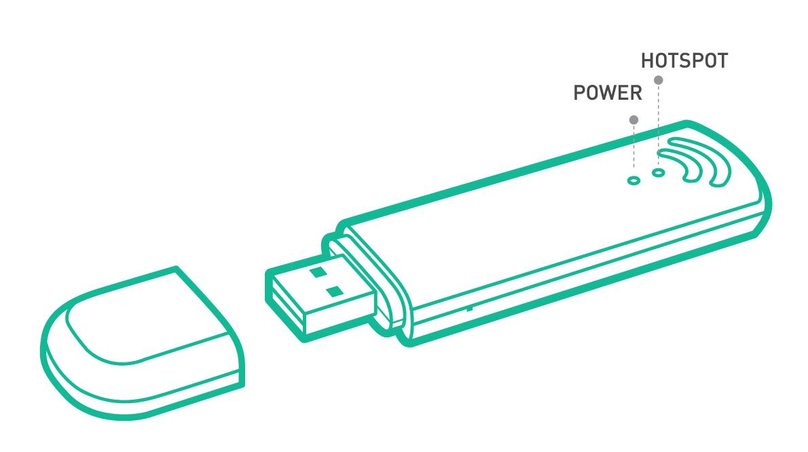
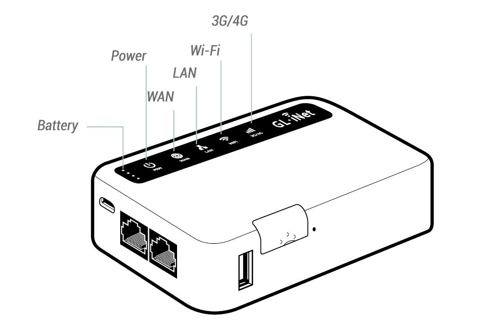

# LED Status Indication

## Mini Router

- **Power**: Solid green LED that indicates the router is powered up.
- **Wireless**:  Solid Red LED that indicates the router is broadcasting Wi-Fi. It will flash when there is wireless data transfer.
- **Configurable**: Can be customized by the user.

## GL-USB150 Microuter

- **Power**: Solid green LED that indicates the router is powered up.
- **Hotspot**:  Solid green LED that indicates the router is broadcasting Wi-Fi. It will flash when there is wireless data transfer.

  ## GL-MiFi 4G Smart Router

  

- **Battery**: Indicate the battery, it will flash when the device is charging until fully charged.
- **Power**: This router is powered on
- **WAN**: 
- **LAN**: This router is connected to client through LAN cable
- **WI-Fi**: Solid LED that indicates the router is broadcasting Wi-Fi. It will flash when there is wireless data transfer.
- **3G/4G**:

  ## GL-AR750 

  

- **Power**: Solid white LED that indicates the router is powered up.
- **2.4GHz Wi-Fi**: Solid white LED that indicates the router is broadcasting 2.4GHz Wi-Fi. It will flash when there is wireless data transfer
- **5GHz Wi-Fi**: Solid white LED that indicates the router is broadcasting 5GHz Wi-Fi. It will flash when there is wireless data transfer

  ## GL-B1300

  

- **Power**: Solid green LED that indicates the router is powered up.
- **Mesh**: Flash green LED indicates that the router is pairing with another router. It will turn solid green when the Mesh network has been created.
- **Wireless**: Solid green LED that indicates the router is broadcasting Wi-Fi. It will flash when there is wireless data transfer.

##LED Customization

To configure the LED of mini router, please login to Luci by clicking **Advanced settings** at the top-right corner of the web admin page. 

​

Then please choose **System** > **LED Configuration**.

